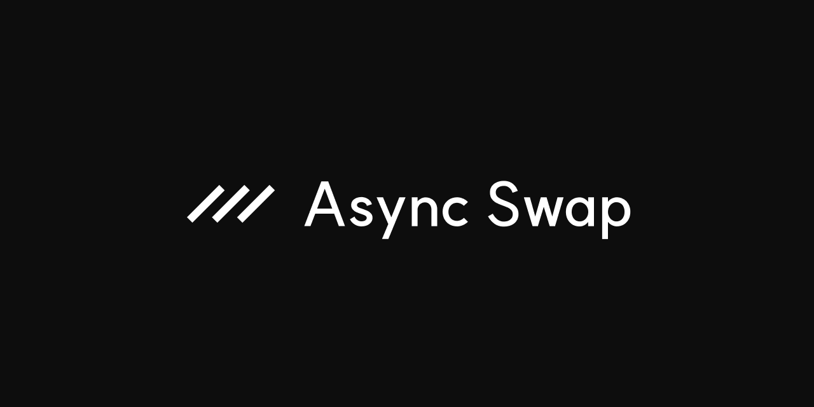

## AsyncSwap

AsyncSwap is an intent-based hook built on Uniswap v4.

Instead of executing trades against AMM liquidity immediately, AsyncSwap records a priced order at a chosen tick, escrows the user's input, and lets external fillers complete the output side later.

### How it works

1. A user submits a swap with a price (tick), amount, and optional deadline
2. The hook escrows the input tokens and records the order
3. Fillers (solvers) see the order and deliver the output tokens to the user
4. The filler receives proportional input claim tokens in return
5. If unfilled, the user can cancel and reclaim their full input

### Design

- intent-based: users express what they want, fillers decide how to deliver
- OTC-like pricing: users post a target price and wait for a counterparty to accept it, instead of taking live AMM spot execution
- on-chain escrow: input tokens are held by the hook until filled or cancelled
- permissionless filling: anyone can fill any order, no solver auction or selection
- coincidence of wants: fillers can batch-settle opposite-direction orders via `batchFill`
- partial fills: each fill must cover at least 50% of remaining, converging in O(log n) fills
- native Uniswap V4 hook: composable with the V4 pool ecosystem

### Features

- async order creation, partial fill, and cancellation
- order expiry with permissionless keeper cleanup
- native input and native output support
- configurable protocol fee with fee refund toggle (fees only on filled volume)
- oracle-aware surplus capture so the protocol internalizes MEV from bad quotes instead of leaking it all to fillers
- configurable user / filler / protocol surplus split via governance-managed oracle settings
- one-time governance token rewards for swappers, fillers, and keepers
- pause / unpause controls
- treasury and per-pool dynamic fee governance
- governance execution through `AsyncGovernor + TimelockController`

### MEV Capture

AsyncSwap can internalize MEV created by bad user quotes.

When an order is filled at a price meaningfully worse than a governance-configured oracle reference, the protocol computes the surplus between the quoted fill and the oracle-fair fill. That surplus can then be split between:

- the user (kept in the order as additional refundable value)
- the filler (as an execution incentive)
- the protocol treasury (as captured surplus)

If the oracle is missing or stale, fills still succeed — the protocol simply skips surplus capture rather than reverting the swap.

## Repo Guide

- `src/AsyncSwap.sol` - main hook contract
- `src/IntentAuth.sol` - ownership, treasury, fee policy, and pause controls
- `src/AsyncRouter.sol` - router callback and exact-input settlement path
- `src/governance/` - token + governor contracts
- `script/README.md` - deployment and governance runbook

## Links

- Documentation: TBA
- Website: [asyncswap.org](https://asyncswap.org)
- Discord: [Discord](https://discord.gg/Eh8fxHf8Sg)
- Twitter: [@asyncswap](https://x.com/asyncswap)

© AsyncSwap Labs, Inc.
